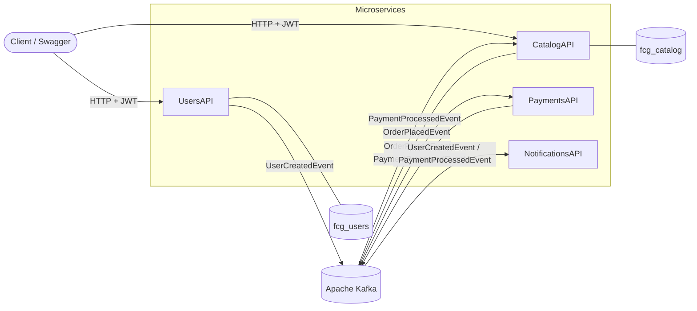

# Architecture — FIAP Cloud Games (Phase 2)

FIAP Cloud Games is an **event-driven microservices** platform for a digital games
store. Phase 2 evolved the Phase 1 .NET 8 monolith into four independent services
that communicate asynchronously over **Apache Kafka**, plus an orchestration
repository holding the local infrastructure and deployment setup.

## Repositories

| Repository | Role | Owns | HTTP | Kafka |
|---|---|---|---|---|
| `fiap-cloud-games-users-api` | Identity: register, login, JWT, roles | `fcg_users` | yes | produces `UserCreatedEvent` |
| `fiap-cloud-games-catalog-api` | Games, library, purchase orchestration | `fcg_catalog` | yes | produces `OrderPlacedEvent`; consumes `PaymentProcessedEvent` |
| `fiap-cloud-games-payments-api` | Simulated payment processing | — (stateless) | `/health` | consumes `OrderPlacedEvent`; produces `PaymentProcessedEvent` |
| `fiap-cloud-games-notifications-api` | Console "e-mail" notifications | — (stateless) | `/health` | consumes `UserCreatedEvent` + `PaymentProcessedEvent` |
| `fiap-cloud-games-orchestration` | Local infra, Compose, Kubernetes, docs | hosts Postgres + Kafka | — | pre-creates topics |

## System diagram

## Component responsibilities

- **UsersAPI** — registration, authentication, **JWT issuance**, roles, user admin. Publishes `UserCreatedEvent`.
- **CatalogAPI** — game CRUD, library reads, and the **purchase entry point** (`POST /api/library/acquire/{gameId}`). Publishes `OrderPlacedEvent`; consumes `PaymentProcessedEvent` and writes the library on approval.
- **PaymentsAPI** — consumes `OrderPlacedEvent`, runs a deterministic payment **simulation**, publishes `PaymentProcessedEvent`. No real provider.
- **NotificationsAPI** — consumes `UserCreatedEvent` (welcome) and `PaymentProcessedEvent` (purchase confirmation, on approval only); logs simulated e-mails to the console. No SMTP.

## Data ownership

- **Database-per-service:** UsersAPI → `fcg_users` (`users`); CatalogAPI → `fcg_catalog` (`games`, `user_games`). PaymentsAPI and NotificationsAPI are **stateless**.
- **No cross-service foreign keys** — `user_games.UserId` is a `Guid` carried in the JWT, never joined to a users table.
- Locally, one PostgreSQL instance hosts both logical databases.

## Messaging

- **Apache Kafka**, single broker, **KRaft mode** (no Zookeeper); `Confluent.Kafka` client.
- Three topics, three consumer groups; **at-least-once** delivery; the library write is **idempotent** (owns-check + unique `(UserId, GameId)` index).
- Contracts: [`../contracts/README.md`](../contracts/README.md). Flows: [`event-flows.md`](event-flows.md).

## Authentication & authorization

- **Shared symmetric JWT** (HMAC-SHA256). UsersAPI **issues** tokens; CatalogAPI **validates** them locally using the same `SecretKey` / `Issuer` / `Audience` — **no synchronous call to UsersAPI**. Roles: `User`, `Admin`. Passwords are stored as **PBKDF2** hashes.

## Bounded contexts

The Phase 1 bounded contexts now map 1:1 to services: Identity → UsersAPI, Catalog + Library → CatalogAPI, Payments → PaymentsAPI, Notifications → NotificationsAPI.

## Design decisions — deliberately NOT built (for this academic MVP)

Transactional **outbox**, **saga**, **dead-letter / retry topics**, **Schema Registry**, **API gateway**, **service mesh**, **distributed tracing**, **CQRS / event sourcing**. Rationale: keep the MVP simple, correct, and demonstrable. Idempotency where it matters comes for free from the unique `(UserId, GameId)` constraint; duplicate console e-mails under at-least-once are acceptable.

## Future production improvements

- Separate physical database instances per service; **PVCs** for stateful pods.
- **RS256 / JWKS** instead of a shared symmetric secret.
- **Azure Key Vault** (or similar) for secrets instead of placeholder Kubernetes Secrets — *documented as a future improvement, not implemented in this MVP*.
- Retries + dead-letter topics; **outbox** for guaranteed publishing; observability (metrics, tracing, dashboards); multi-broker Kafka with replication.
