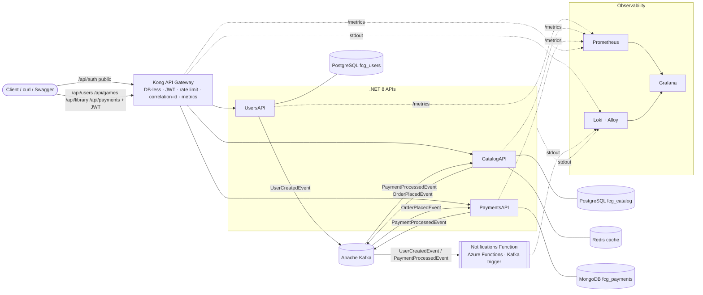

# Architecture — FIAP Cloud Games (Phase 3)

FIAP Cloud Games is an **event-driven microservices** platform for a digital games store.
Phase 2 split the Phase 1 .NET 8 monolith into independent services communicating over
**Apache Kafka**. Phase 3 adds an **API Gateway**, a **serverless** notification path, a
**NoSQL** store, a **distributed cache** and **observability** (metrics + centralized logs),
all still **local-first** and reproducible with Docker Compose and local Kubernetes.

## Repositories

| Repository | Role | Owns | HTTP | Kafka |
|---|---|---|---|---|
| `fiap-cloud-games-users-api` | Identity: register, login, **JWT issuance**, roles | PostgreSQL `fcg_users` | `/api/auth/*`, `/api/users/*`, `/metrics` | produces `UserCreatedEvent` |
| `fiap-cloud-games-catalog-api` | Games, library, purchase orchestration, **Redis cache** | PostgreSQL `fcg_catalog` + Redis (cache) | `/api/games/*`, `/api/library/*`, `/metrics` | produces `OrderPlacedEvent`; consumes `PaymentProcessedEvent` |
| `fiap-cloud-games-payments-api` | Simulated payment processing, **payment history** | MongoDB `fcg_payments` | `/api/payments/order/{orderId}`, `/metrics` | consumes `OrderPlacedEvent`; produces `PaymentProcessedEvent` |
| `fiap-cloud-games-notifications-function` | **Serverless** notifications (Azure Functions, Kafka trigger) | — (stateless) | — | consumes `UserCreatedEvent` + `PaymentProcessedEvent` |
| `fiap-cloud-games-notifications-api` | Phase 2 notifications consumer — **history only**, replaced by the function | — | `/health` | (Compose `phase2-legacy` profile only) |
| `fiap-cloud-games-orchestration` | Compose, Kubernetes, Kong config, observability config, contracts, docs | hosts the infrastructure | — | pre-creates topics |

## System diagram

## Component responsibilities

- **Kong API Gateway** (DB-less, `gateway/kong.yml`) — the official entry point. Routes by
  prefix without rewriting paths; public `/api/auth/*`; JWT validated at the edge for
  `/api/users/*`, `/api/games/*`, `/api/library/*`, `/api/payments/*`; rate limiting
  (5 req/s, 120 req/min), correlation id, Prometheus plugin. [gateway.md](gateway.md)
- **UsersAPI** — registration, authentication, JWT issuance, roles, user admin. Publishes `UserCreatedEvent`.
- **CatalogAPI** — game CRUD, library reads, purchase entry point; publishes `OrderPlacedEvent`,
  consumes `PaymentProcessedEvent` and writes the library on approval. **Redis cache-aside** on
  the read model with explicit invalidation. [cache.md](cache.md)
- **PaymentsAPI** — consumes `OrderPlacedEvent`, runs the deterministic simulation, **persists
  one payment document per order in MongoDB** (idempotent upsert), publishes
  `PaymentProcessedEvent`, exposes the protected payment-status query. [nosql.md](nosql.md)
- **Notifications Function** — Azure Functions (.NET 8 isolated worker) triggered by Kafka:
  `[WELCOME EMAIL]` on `fcg.users.created`, `[PURCHASE CONFIRMATION]` on approved
  `fcg.payments.processed`; rejected payments are logged without an e-mail. Runs with
  `func start`, as a Compose container or as a Kubernetes Deployment. Replaces the Phase 2
  NotificationsAPI in the main flow.
- **Observability** — Prometheus scrapes the three APIs and Kong; Alloy ships every Compose
  container's logs to Loki; Grafana (provisioned from files) shows **FCG Overview** (metrics)
  and **FCG Logs**. [observability.md](observability.md)

## Data ownership

- **Database-per-service, polyglot:** UsersAPI → PostgreSQL `fcg_users`; CatalogAPI →
  PostgreSQL `fcg_catalog` (+ Redis as a cache only); PaymentsAPI → MongoDB `fcg_payments`
  (`payments`, unique index on `orderId`); the function is stateless.
- **No cross-service foreign keys** — ids travel in events and in the JWT.
- Locally, one PostgreSQL instance hosts both relational databases.

## Messaging

- **Apache Kafka**, single broker, KRaft (no Zookeeper); `Confluent.Kafka` in the APIs, the
  Azure Functions Kafka extension in the function.
- Three topics, three consumer groups (`payments-service`, `catalog-service`,
  `notifications-function`); **at-least-once** delivery. Idempotency: library write
  (owns-check + unique `(UserId, GameId)`), payment history (upsert by `orderId` + unique
  index), notifications (log only). Contracts: [`../contracts/README.md`](../contracts/README.md);
  flows: [event-flows.md](event-flows.md).

## Authentication & authorization

- **Shared symmetric JWT** (HMAC-SHA256) issued by UsersAPI. **Kong** validates signature and
  expiry at the edge (consumer credential keyed by the `iss` claim). UsersAPI, CatalogAPI and
  PaymentsAPI validate the token again (**defense in depth**) and own all **authorization**:
  roles (`User`, `Admin`) and ownership (a user only reads their own payments). Passwords are
  PBKDF2 hashes. No IdentityServer, no JWKS, no external provider.

## Deployment targets

- **Docker Compose** — the full stack in one command, host ports parameterized in `.env`,
  Notifications Function as the main notification path, `notifications-api` only under the
  `phase2-legacy` profile. [../README.md](../README.md)
- **Local Kubernetes** (Docker Desktop) — pure manifests in namespace `fcg`; Kong on NodePort
  30080, Prometheus 30090, Grafana 30300; gateway/observability ConfigMaps generated from the
  same files Compose uses. [kubernetes.md](kubernetes.md)

## Design decisions — deliberately NOT built (academic MVP)

Transactional **outbox**, **saga**, dead-letter/retry topics, Schema Registry, service mesh,
**distributed tracing** (correlation is achieved with `OrderId`/`UserId` in logs and the
gateway correlation id), CQRS/event sourcing, Ingress/Helm, Alertmanager, Loki on
Kubernetes (Alloy DaemonSet + RBAC), real cloud resources, real secrets. Rationale: keep the
platform simple, correct and demonstrable locally.

## Future production improvements (documented only)

- Azure Function App (Premium/Dedicated plan; the Kafka trigger is not supported on the
  classic Consumption plan) with Event Hubs (Kafka protocol) or a managed Kafka over SASL_SSL;
  KEDA for scale-to-zero on Kubernetes.
- **Azure Key Vault** (or similar) for secrets; RS256/JWKS instead of the shared symmetric key.
- Managed MongoDB (Cosmos DB for MongoDB / Atlas), managed Redis, Kong on AKS or Kong Konnect,
  managed Grafana/Prometheus, Loki on Kubernetes.
- Outbox + retries/DLQ, multi-broker Kafka, PVCs for stateful pods, CI/CD pipelines.
