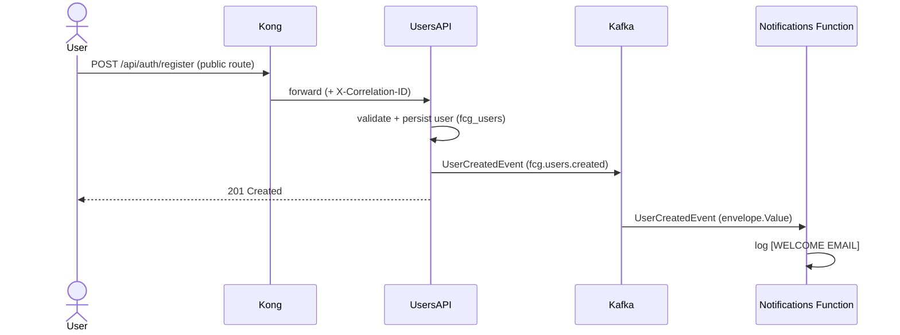

# Event Flows — FIAP Cloud Games (Phase 3)

Asynchronous communication runs over three Kafka topics. Canonical event shapes live in
[`../contracts/README.md`](../contracts/README.md). Since Phase 3 every HTTP call enters
through **Kong** (JWT validated at the edge on protected routes) and the notifications are
handled by the **Notifications Function** (Azure Functions, Kafka trigger).

## Topics & consumer groups

| Topic | Key | Producer | Consumer group(s) |
|---|---|---|---|
| `fcg.users.created` | `UserId` | UsersAPI | `notifications-function` |
| `fcg.orders.placed` | `OrderId` | CatalogAPI | `payments-service` |
| `fcg.payments.processed` | `OrderId` | PaymentsAPI | `catalog-service` **and** `notifications-function` |

> `fcg.payments.processed` **fans out** to two distinct consumer groups, so both CatalogAPI
> and the Notifications Function receive every payment result.

Delivery is **at-least-once** (offsets committed after handling). Duplicates are safe:
CatalogAPI's library write is idempotent (owns-check + unique index), PaymentsAPI's history
write is an upsert by `orderId` (unique index), the function only logs.

## Flow 1 — user registration → welcome e-mail



## Flow 2 — purchase (approved)

```mermaid
sequenceDiagram
  actor User
  participant G as Kong
  participant C as CatalogAPI
  participant K as Kafka
  participant P as PaymentsAPI
  participant M as MongoDB
  participant R as Redis
  participant F as Notifications Function
  User->>G: POST /api/library/acquire/{gameId} (JWT)
  G->>G: validate JWT (signature + exp)
  G->>C: forward
  C->>C: validate JWT again; game active; 409 if already owned
  C->>K: OrderPlacedEvent (fcg.orders.placed)
  C-->>User: 202 Accepted {orderId}
  K->>P: OrderPlacedEvent
  P->>P: simulation -> Approved
  P->>M: upsert payment document (orderId, status, reason, ...)
  P->>K: PaymentProcessedEvent (Approved)
  K->>C: PaymentProcessedEvent
  C->>C: add user_games (idempotent)
  C->>R: invalidate library:{userId}
  K->>F: PaymentProcessedEvent
  F->>F: log [PURCHASE CONFIRMATION] (contains the OrderId)
  User->>G: GET /api/payments/order/{orderId} (JWT)
  G->>P: forward
  P->>M: find by orderId (owner or Admin)
  P-->>User: 200 {status: Approved, reason, ...}
  User->>G: GET /api/library/my-games (JWT)
  G->>C: forward
  C->>R: MISS -> load from PostgreSQL -> SET; next call HIT
  C-->>User: 200 [purchased game] (X-FCG-Cache)
```

## Flow 2 — purchase (rejected)

```mermaid
sequenceDiagram
  actor User
  participant G as Kong
  participant C as CatalogAPI
  participant K as Kafka
  participant P as PaymentsAPI
  participant M as MongoDB
  participant F as Notifications Function
  User->>G: POST /api/library/acquire/{gameId} (JWT, price > 1000)
  G->>C: forward
  C->>K: OrderPlacedEvent
  C-->>User: 202 Accepted {orderId}
  K->>P: OrderPlacedEvent
  P->>P: simulation -> Rejected (above the approval limit)
  P->>M: upsert payment document (status Rejected + reason)
  P->>K: PaymentProcessedEvent (Rejected)
  K->>C: PaymentProcessedEvent
  C->>C: no library write, no cache invalidation
  K->>F: PaymentProcessedEvent
  F->>F: log "Payment Rejected ...; no confirmation e-mail sent."
  User->>G: GET /api/payments/order/{orderId} (JWT)
  G->>P: forward
  P-->>User: 200 {status: Rejected, reason}
```

## Idempotency, ordering and replay

- **OrderId** correlates Order → Payment → History → Library → Notification across the flow
  and is the key to trace a purchase in the centralized logs (`{platform="fcg"} |= "<orderId>"`).
- CatalogAPI's `PurchaseCompletionService` skips when the user already owns the game and
  catches the unique-constraint violation; PaymentsAPI's upsert keeps one document per order
  (`createdAt` preserved, `updatedAt` refreshed). Replaying the same `OrderPlacedEvent` was
  validated: one Mongo document, catalog "already owns", a second (harmless) confirmation log.
- Single partition per topic (MVP) gives per-topic ordering.
