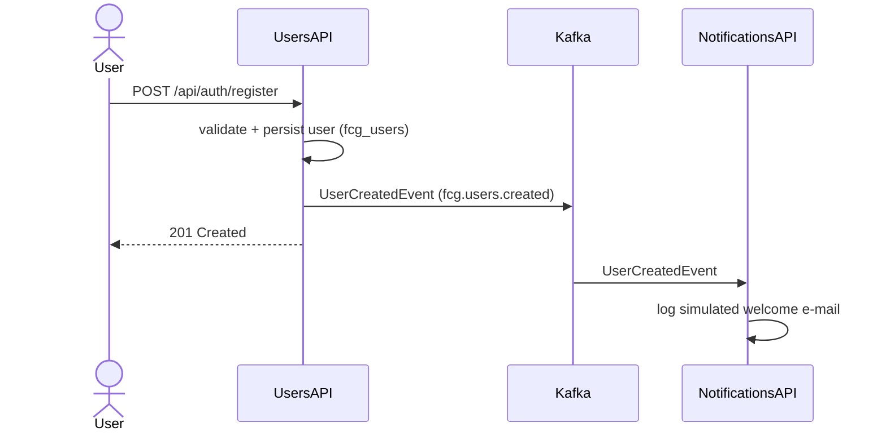
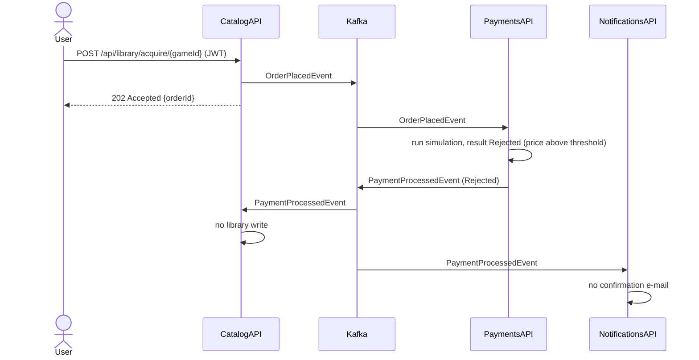

# Event Flows — FIAP Cloud Games (Phase 2)

Asynchronous communication runs over three Kafka topics. Canonical event shapes
live in [`../contracts/README.md`](../contracts/README.md).

## Topics & consumer groups

| Topic | Key | Producer | Consumer group(s) |
|---|---|---|---|
| `fcg.users.created` | `UserId` | UsersAPI | `notifications-service` |
| `fcg.orders.placed` | `OrderId` | CatalogAPI | `payments-service` |
| `fcg.payments.processed` | `OrderId` | PaymentsAPI | `catalog-service` **and** `notifications-service` |

> `fcg.payments.processed` **fans out** to two distinct consumer groups, so both
> CatalogAPI and NotificationsAPI receive every payment result.

Delivery is **at-least-once** (manual offset commit after handling). Duplicates are
safe: CatalogAPI's library write is idempotent (owns-check + unique index);
NotificationsAPI only logs.

## Flow 1 — user registration → welcome e-mail



## Flow 2 — purchase (approved)

```mermaid
sequenceDiagram
  actor User
  participant C as CatalogAPI
  participant K as Kafka
  participant P as PaymentsAPI
  participant N as NotificationsAPI
  User->>C: POST /api/library/acquire/{gameId} (JWT)
  C->>C: validate game active + read price; 409 if already owned
  C->>K: OrderPlacedEvent (fcg.orders.placed)
  C-->>User: 202 Accepted {orderId}
  K->>P: OrderPlacedEvent
  P->>P: run simulation, result Approved
  P->>K: PaymentProcessedEvent (Approved) (fcg.payments.processed)
  K->>C: PaymentProcessedEvent
  C->>C: add user_games (idempotent)
  K->>N: PaymentProcessedEvent
  N->>N: log purchase confirmation e-mail
```

Later, `GET /api/library/my-games` returns the purchased game.

## Flow 2 — purchase (rejected)



## Idempotency & ordering notes

- **OrderId** correlates Order → Payment → Library across the flow.
- CatalogAPI's `PurchaseCompletionService` skips when the user already owns the game
  (`ExistsAsync`) and additionally catches the unique-constraint violation — a
  duplicate approved event never creates a second `user_games` row and never
  crashes the consumer.
- Single partition per topic (MVP) gives per-topic ordering.
